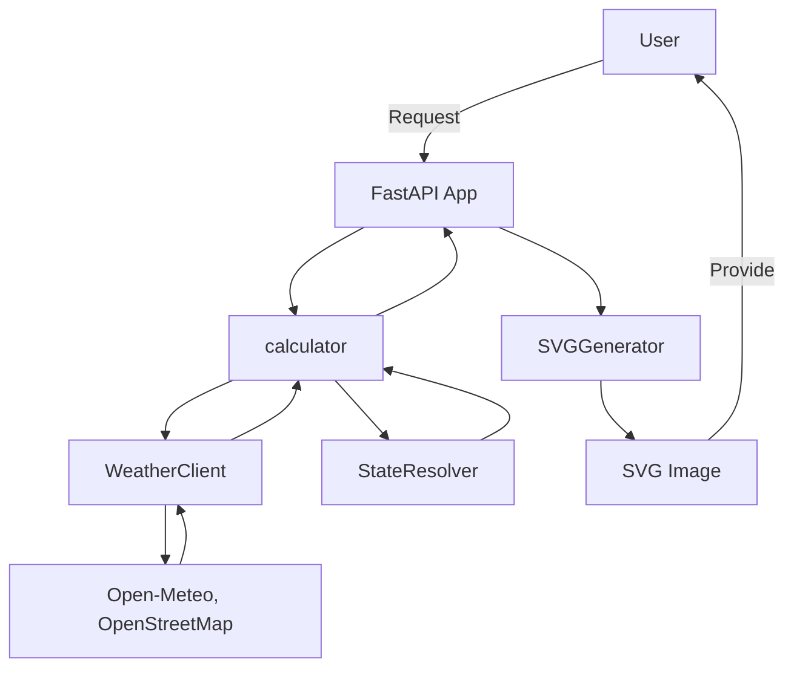

# Weather Header

Dynamic weather graphic as animation, for your GitHub profile.

## Features

- Fetches weather data & local time from user location and resolves into pre-made weather states
- Generate and provide SVG with corresponding animation for dynamic display on GitHub profile

## Architecture



## Project Structure

```
src/weather_header/
├── artist/
│ └── generator.py # SVG construction
├── calculator/
│ ├── **init**.py
│ ├── weather_client.py # API integration
│ ├── resolver.py # State logic
│ ├── schemas.py # Pydantic models
│ └── assets.py # Asset metadata
├── templates/
│ ├── svg/ # SVG Jinja2 templates
│ └── web/ # Frontend HTML
└── main.py # FastAPI application
```

## Roadmap

### Immediate

- Pixel animation generation pipeline for default assets
- Create default animations and templates
- Polish SVG generator

### Long-term

- SQLite DB for user management
- Pipeline for custom background, animation, etc. per user
- Simple HTML frontend for user configuration
- Dockerization for easy deployment
